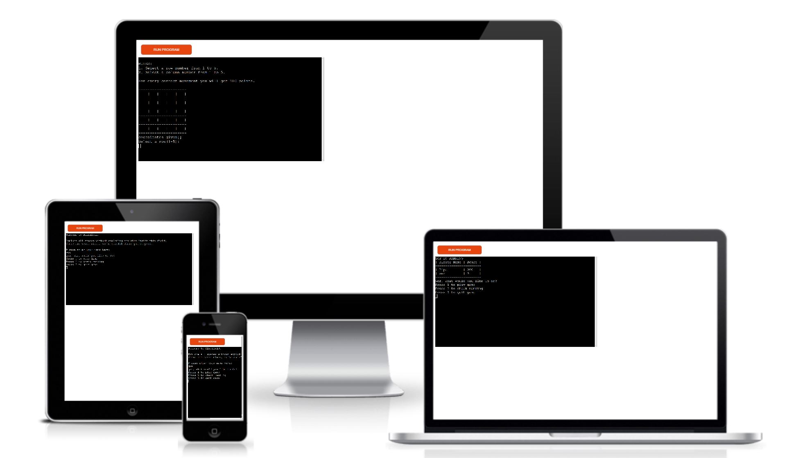
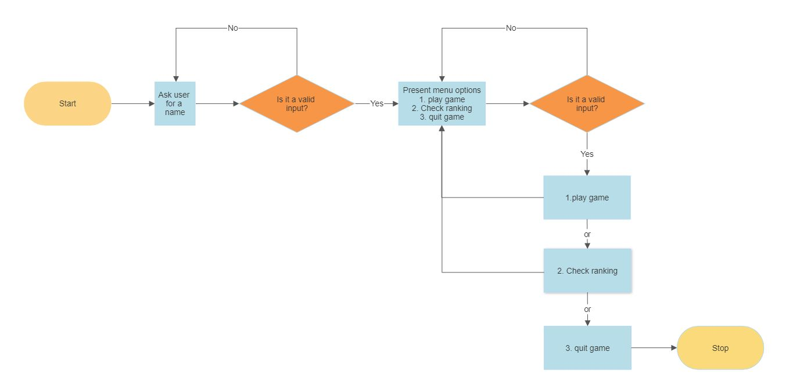
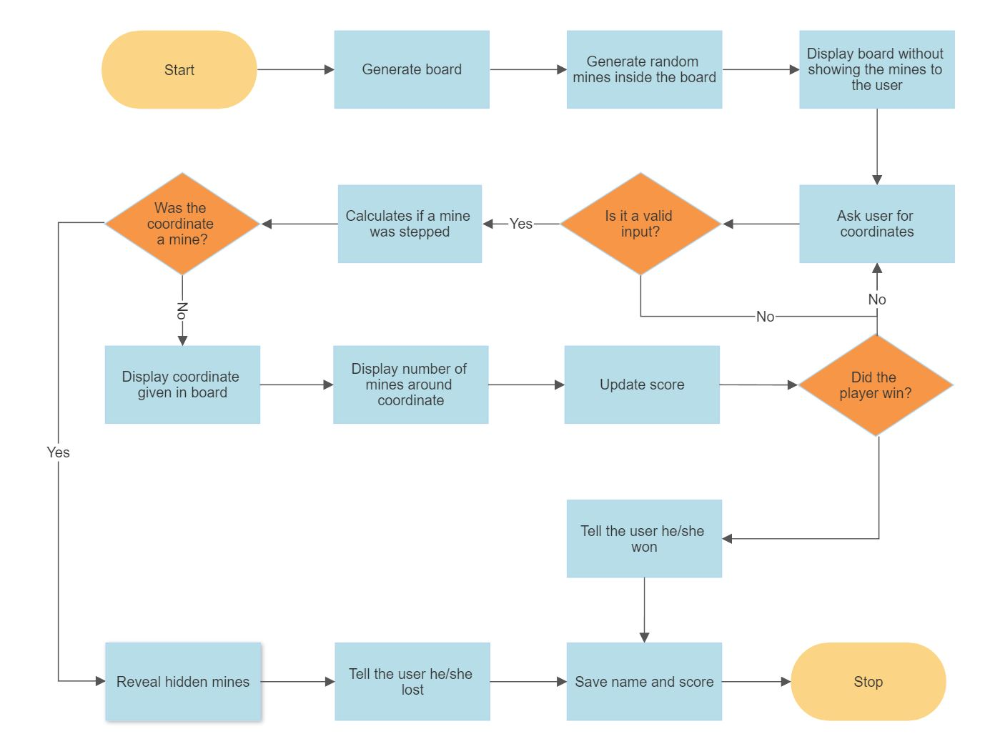

<h1 align="center">Minefield - Portfolio Project 3</h1>

Minefield is a python terminal game of [minesweeper](https://en.wikipedia.org/wiki/Minesweeper_(video_game)) and it is deployed on Heroku.

The game presents an introduction to the game's theme. The player is then prompted to enter his or her name.

Once the user has given his name, he will have a menu with 3 options at his disposal. Option 1 allows the user to start the game, option 2 allows the user to view the ranking and option 3 allows the user to end the interaction with the program.

If the user starts the game, he will be explained how to give the coordinates and will be presented with the minefield, the user can take values from 1 to 5 to give his coordinates. 

Every time the game ends, either because the player stepped on a mine or won, the score obtained will be saved and the menu will be presented for the user to decide if he wants to continue playing, check the ranking or end the interaction with the program.

Once the user has finished the interaction with the program, it will update the ranking for the next interaction.

The deployed application can be found at [minefield](https://minefield.herokuapp.com/)
## UX & Design

### User Stories

* As a user, I want to be able to type my name and know if the information is valid.
* As a user, I want to be able to read the rules of the game.
* As a user, I want to be able to know how many mines are in the minefield.
* As a user, I want to be able to see the current ranking.
* As a user, I want to be able to see the given coordinate represented in the minefield.
* As a user, I want to be able to see the number of mines around the given position.
* As a user, I want to be able to see what coordinates I have entered during the game.
* As a user, I want to be able to see my score during and at the end of the game.
* As a user, I want to be able to know if the coordinates I am entering are valid.
* As a user, I want to be able to replay the game as many times as I want.

### Flowchart

#### Main Flowchart

#### Play game

#### Check ranking & quit game

